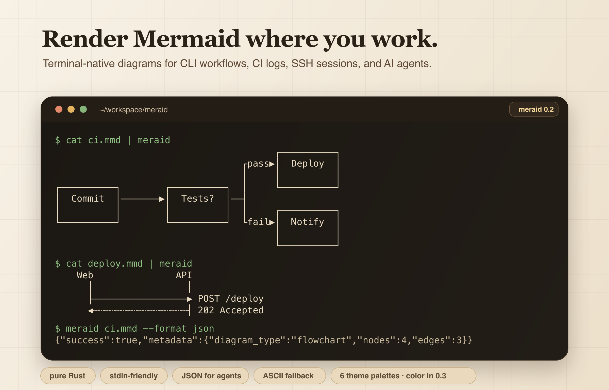

<h1 align="center">meraid</h1>

<p align="center">Render Mermaid diagrams in your terminal or Rust application.</p>

<p align="center">
  
</p>

<p align="center">
  <a href="https://crates.io/crates/meraid">
    
  </a>
  <a href="https://github.com/Binlogo/meraid/actions">
    
  </a>
  <a href="https://opensource.org/licenses/MIT">
    
  </a>
  <a href="https://rust-lang.org">
    
  </a>
</p>

[简体中文](README-zh.md)

## Features

- **Self-contained** — pure Rust with a small, well-known dependency set. No
  browser, no Node, no external Mermaid service.
- **AI-friendly** — `--format json` returns the rendered diagram plus metadata,
  with machine-parseable errors. Handy for AI coding agents.
- **6 diagram types** — flowcharts, sequence, class, state, pie, and ER diagrams.
- **ASCII fallback** — `--ascii` works on any terminal, even the most basic ones.
- **Pipe-friendly CLI** — `cat diagram.mmd | meraid` just works.
- **CJK-aware** — Chinese/Japanese/Korean text keeps box borders aligned.
- **Color themes** — pick a palette with `--theme`; meraid emits ANSI color
  (truecolor or 256-color) when writing to a terminal, and stays plain when
  piped or redirected.

## Why meraid?

Mermaid is excellent for documentation, but rendering it usually requires a
browser or an external service. meraid renders Mermaid directly in your
terminal — perfect for SSH sessions, CI logs, TUI applications, or any
environment with Rust. It's a fast, self-contained alternative for terminal use.

## Install

### From Crates.io

```bash
cargo install meraid
```

### From Git (latest)

```bash
cargo install --git https://github.com/Binlogo/meraid.git
```

### From source

```bash
git clone https://github.com/Binlogo/meraid.git
cd meraid
cargo install --path .
```

> Homebrew support is planned but not yet available.

## Quick Start

### CLI

```bash
# Render from file
meraid diagram.mmd

# Render from stdin
echo "graph LR; A-->B-->C" | meraid

# Select a theme palette (color is emitted on a terminal)
meraid diagram.mmd --theme neon

# Force color through a pipe, e.g. into a pager
meraid diagram.mmd --theme neon --color always | less -R

# ASCII-only output
meraid diagram.mmd --ascii

# JSON output (AI-friendly)
meraid diagram.mmd --format json
```

### Rust Library

```rust
use meraid::{render, ThemeType};

fn main() {
    let diagram = render("graph LR\n  A --> B --> C", ThemeType::Default).unwrap();
    println!("{}", diagram);
}
```

## Supported Diagram Types

The output blocks below are produced by the binary itself.

### Flowcharts

````mermaid
graph LR
    A[Start] --> B[Process] --> C[Done]
````

```
┌──────────┐    ┌──────────┐    ┌──────────┐
│  Start   │───▶│ Process  │───▶│   Done   │
│          │    │          │    │          │
└──────────┘    └──────────┘    └──────────┘
```

Branching graphs lay out as a diamond: a decision node's outcomes straddle the
trunk (one above, one below), each labelled on its own branch, with forks and
merges drawn as real `┤` / `┴` junctions.

````mermaid
graph LR
    A[Start] --> B{OK?}
    B -->|yes| C[Save]
    B -->|no| D[Stop]
````

```
                                      ┌──────────┐
                                 ┌yes▶│   Save   │
                                 │    │          │
┌──────────┐       ┌──────────┐  │    └──────────┘
│  Start   │──────▶│   OK?    │──┤
│          │       │          │  │    ┌──────────┐
└──────────┘       └──────────┘  └no─▶│   Stop   │
                                      │          │
                                      └──────────┘
```

- **Node shapes** are parsed — rectangle `[text]`, rounded `(text)`, diamond
  `{text}`, stadium `([text])`, subroutine `[[text]]`, and more. In 0.2 every
  node is drawn as a box; distinct shape glyphs are planned for 0.3.
- **Edge labels** `-->|text|` are rendered on the branch.
- **Edge styles** `-->` (solid), `-.->` (dotted), and `==>` (thick) are parsed.
  Distinct visual styling for dotted/thick edges is planned for 0.3.
- **Directions** `LR`, `RL`, `TD`/`TB`, `BT` are parsed. The layout is currently
  left-to-right regardless of the declared direction; direction-aware layout is
  planned for 0.3.

### Sequence Diagrams

````mermaid
sequenceDiagram
    Alice->>Bob: Hello Bob
    Bob-->>Alice: Hi Alice
````

```
   Alice              Bob

      │                 │

      ├─────────────────▶ Hello Bob
      ◀┄┄┄┄┄┄┄┄┄┄┄┄┄┄┄┄┄┤ Hi Alice
```

- **Message types:** solid arrow `->>`, dashed arrow `-->>` (rendered dashed).
- **Participants:** declared with `participant` / `actor`, or inferred from
  messages.

### Class Diagrams

````mermaid
classDiagram
    class Animal {
        +String name
        +makeSound()
    }
    class Dog {
        +fetch()
    }
    Animal <|-- Dog
````

```
┌────────────────┐
│     Animal     │
├────────────────┤
│+String name    │
├────────────────┤
│+makeSound()    │
└────────────────┘

┌────────────────┐
│      Dog       │
├────────────────┤
│+fetch()        │
└────────────────┘

Animal <|-- Dog
```

- **Members:** fields and methods with visibility (`+` public, `-` private,
  `#` protected, `~` package). A divider separates fields from methods.
- **Relationships:** `<|--`, `*--`, `o--`, `--|>`, `..>`, `..|>`, and plain `--`
  are parsed and shown as a text legend below the boxes.

### State Diagrams

````mermaid
stateDiagram-v2
    [*] --> Idle
    Idle --> Processing: start
    Processing --> Done: complete
    Done --> [*]
````

```
● ──▶ Idle
Idle ──▶ Processing : start
Processing ──▶ Done : complete
Done ──▶ ◉
```

- `[*]` renders as a start (`●`) or end (`◉`) marker.
- Transition labels (`: text`) are shown.
- Composite/nested states are not yet supported.

### Pie Charts

````mermaid
pie title Pets adopted by volunteers
    "Dogs" : 386
    "Cats" : 85
    "Rats" : 15
````

```
Dogs┃████████████████████████████████ 79.4%
Cats┃███████ 17.5%
Rats┃█ 3.1%
```

### ER Diagrams

````mermaid
erDiagram
    CUSTOMER {
        int id PK
        string name
    }
    ORDER {
        int id PK
        int customer_id FK
    }
    CUSTOMER ||--o{ ORDER : places
````

```
┌────────────────────┐
│      CUSTOMER      │
├────────────────────┤
│PK    : id          │
│      : name        │
└────────────────────┘

┌────────────────────┐
│       ORDER        │
├────────────────────┤
│PK    : id          │
│   FK : customer_id │
└────────────────────┘

CUSTOMER ||--o{ ORDER
```

**Cardinality notation:** `||` exactly one, `}|`/`|{` one or more,
`o|`/`|o` zero or one, `o{`/`}o` zero or more. **Attribute markers:** `PK`
primary key, `FK` foreign key. Relationships are shown as a text legend below
the entity boxes.

## CLI Options

| Flag | Description |
|------|-------------|
| `--ascii`, `-a` | ASCII-only output (no Unicode box-drawing) |
| `--theme <NAME>` | Theme palette: `default`, `terra`, `neon`, `mono`, `amber`, `phosphor`. `default` inherits your terminal's colors; the others recolor by role. |
| `--color <WHEN>` | When to emit ANSI color: `auto` (default — only on a terminal), `always`, or `never`. Honors `NO_COLOR`; `--color always` overrides it. JSON output is always uncolored. |
| `--format <FORMAT>` | Output format: `text` (default) or `json` |
| `--padding-x <N>` / `--padding-y <N>` | Reserved box-padding options (accepted but not yet applied) |

## Themes

Six theme palettes can be selected with `--theme`:

| Theme | Intended look |
|-------|---------------|
| `default` | Default terminal colors |
| `terra` | Warm earth tones |
| `neon` | Cyberpunk magenta/green |
| `mono` | White/gray monochrome |
| `amber` | Classic amber monitor |
| `phosphor` | Classic green terminal |

Color is **foreground-only** and emitted by role (node text, edges, edge
labels, start/end markers). meraid emits **truecolor** when your terminal
advertises it (`COLORTERM=truecolor`/`24bit`) and falls back to **256-color**
otherwise. The `default` theme inherits your terminal's own colors, so it looks
the same whether or not color is enabled — pick another palette to recolor.
Background fills are reserved for a future release.

## Roadmap

Shipped in 0.2:

- [x] ER diagrams
- [x] Correct node-shape/label parsing for flowcharts
- [x] Branch-aware flowchart layout (diamonds, labelled branches, junctions)
- [x] Honest, machine-parseable errors for invalid input

Planned for 0.3 and beyond:

- [x] ANSI **color** output for the theme palettes (truecolor / 256-color,
  TTY-aware, `--color` flag, `NO_COLOR` honored)
- [ ] Node-shape **glyphs** (diamond, stadium, rounded, …)
- [ ] Direction-aware layout (`TD`/`BT`/`RL`)
- [ ] Distinct rendering for dotted/thick edge styles
- [ ] Composite states; sequence notes & activations
- [ ] More themes (gruvbox, monokai, dracula, nord, solarized)
- [ ] Auto-fit to terminal width
- [ ] Interactive TUI viewer

## Contributing

Contributions are welcome! See [CONTRIBUTING.md](CONTRIBUTING.md) for build,
test, and PR guidelines. In short:

1. Fork the repository and create a feature branch.
2. Make your change and add a test for it.
3. Run `cargo fmt`, `cargo clippy --all-targets -- -D warnings`, and `cargo test`.
4. Open a Pull Request.

## Acknowledgements

Inspired by [termaid](https://github.com/fasouto/termaid) by fasouto.

## License

MIT License — see [LICENSE](LICENSE) for details.

---

<p align="center">Made with ❤️ in Rust</p>
