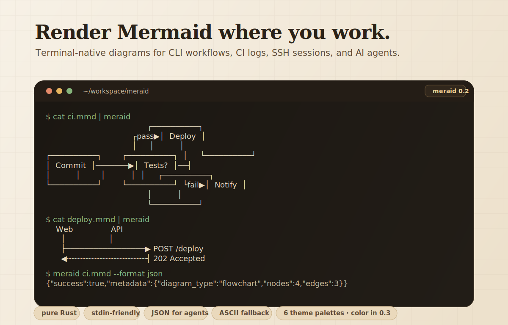

<h1 align="center">meraid</h1>

<p align="center">Render Mermaid diagrams in your terminal or Rust application.</p>

<p align="center">
  
</p>

<p align="center">
  <a href="https://crates.io/crates/meraid">
    
  </a>
  <a href="https://github.com/Binlogo/meraid/actions">
    
  </a>
  <a href="https://opensource.org/licenses/MIT">
    
  </a>
  <a href="https://rust-lang.org">
    
  </a>
</p>

## Features

- **Pure Rust implementation** — Zero external dependencies, blazing fast, fully portable
- **AI-friendly** — JSON output mode for programmatic parsing, perfect for AI coding agents
- **5+ diagram types** — Flowcharts, sequence diagrams, class diagrams, state diagrams, pie charts
- **6 color themes** — default, terra, neon, mono, amber, phosphor
- **ASCII fallback** — Works on any terminal, even the most basic ones
- **Pipe-friendly CLI** — `cat diagram.mmd | meraid` just works

## Why Meraid?

Mermaid is excellent for documentation, but rendering it typically requires a browser or external service. Meraid brings Mermaid rendering directly to your terminal — perfect for SSH sessions, CI logs, TUI applications, or any environment with Rust.

Built with love for the Rust ecosystem, providing a fast, dependency-free alternative to existing solutions.

## Install

### From Crates.io

```bash
cargo install meraid
```

### From Source

```bash
git clone https://github.com/Binlogo/meraid.git
cd meraid
cargo build --release
cargo install --path .
```

### With Homebrew (coming soon)

```bash
brew install meraid
```

## Quick Start

### CLI

```bash
# Render from file
meraid diagram.mmd

# Render from stdin
echo "graph LR; A-->B-->C" | meraid

# Use a theme
meraid diagram.mmd --theme neon

# ASCII-only output
meraid diagram.mmd --ascii

# JSON output (AI-friendly)
meraid diagram.mmd --format json
```

### Rust Library

```rust
use meraid::{render, ThemeType};

fn main() {
    let diagram = render("graph LR\n  A --> B --> C", ThemeType::Default).unwrap();
    println!("{}", diagram);
}
```

## Supported Diagram Types

### Flowcharts

All directions supported: `LR`, `RL`, `TD`/`TB`, `BT`.

````mermaid
graph TD
    A[Start] --> B{Is valid?}
    B -->|Yes| C(Process)
    C --> D([Done])
    B -->|No| E[Error]
````

```
┌─────────────┐
│             │
│    Start    │
│             │
└──────┬──────┘
       │
       ▼
┌──────◇──────┐
│             │
│  Is valid?  │
│             │
└──────◇──────┘
       │
       ╰──────────────────╮
    Yes│                  │No
       ▼                  ▼
╭─────────────╮    ┌─────────────┐
│             │    │             │
│   Process   │    │    Error    │
│             │    │             │
╰──────┬──────╯    └─────────────┘
       │
       ▼
╭─────────────╮
(             )
(    Done     )
(             )
╰─────────────╯
```

**Node shapes:** rectangle `[text]`, rounded `(text)`, diamond `{text}`, stadium `([text])`, subroutine `[[text]]`

**Edge styles:** solid `-->`, dotted `-.->`, thick `==>`, labeled `-->|text|`

### Sequence Diagrams

````mermaid
sequenceDiagram
    Alice->>Bob: Hello Bob
    Bob-->>Alice: Hi Alice
    Alice->>Bob: How are you?
    Bob-->>Alice: Great!
````

```
 ┌──────────┐      ┌──────────┐
 │  Alice   │      │   Bob    │
 └──────────┘      └──────────┘
      ┆ Hello Bob       ┆
      ──────────────────►
      ┆ Hi Alice        ┆
      ◄┄┄┄┄┄┄┄┄┄┄┄┄┄┄┄┄┄
      ┆ How are you?    ┆
      ──────────────────►
      ┆ Great!          ┆
      ◄┄┄┄┄┄┄┄┄┄┄┄┄┄┄┄┄┄
```

**Message types:** solid arrow `->>`, dashed arrow `-->>`

**Participants:** `participant`, `actor`, aliases

### Class Diagrams

````mermaid
classDiagram
    class Animal {
        +String name
        +int age
        +makeSound()
    }
    class Dog {
        +String breed
        +fetch()
    }
    Animal <|-- Dog
````

```
  ┌──────────────┐
  │    Animal    │
  ├──────────────┤
  │ +String name │
  │ +int age     │
  ├──────────────┤
  │ +makeSound() │
  └──────────────┘
          △
          │
  ┌───────────────┐
  │      Dog      │
  ├───────────────┤
  │ +String breed │
  ├───────────────┤
  │ +fetch()      │
  └───────────────┘
```

**Relationships:** inheritance `<|--`, composition `*--`, aggregation `o--`, association `--`

**Members:** attributes and methods with visibility (`+` public, `-` private, `#` protected)

### State Diagrams

````mermaid
stateDiagram-v2
    [*] --> Idle
    Idle --> Processing: start
    Processing --> Done: complete
    Done --> [*]
````

```
╭───────◯──────╮
│              │
│      ●       │
│              │
╰───────◯──────╯
        │
        ▼
╭──────────────╮
│              │
│     Idle     │
│              │
╰───────┬──────╯
        │
   start│
        ▼
╭──────────────╮
│              │
│  Processing  │
│              │
╰───────┬──────╯
        │
complete│
        ▼
╭──────────────╮
│              │
│     Done     │
│              │
╰───────┬──────╯
        │
        ▼
╭───────◯──────╮
│              │
│      ◉       │
│              │
╰───────◯──────╯
```

**Features:** `[*]` start/end states, transition labels, composite states

### Pie Charts

````mermaid
pie title Pets adopted by volunteers
    "Dogs" : 386
    "Cats" : 85
    "Rats" : 15
````

```
  Dogs┃████████████████████████████████  79.4%
  Cats┃▓▓▓▓▓▓▓  17.5%
  Rats┃░   3.1%
```

### ER Diagrams

````mermaid
erDiagram
    CUSTOMER {
        int id PK
        string name
        string email
    }
    ORDER {
        int id PK
        int customer_id FK
        date order_date
    }
    CUSTOMER ||--o{ ORDER : places
````

```
  ┌────────────────────┐
  │      CUSTOMER      │
  ├────────────────────┤
  │PK    : id          │
  │      : name        │
  │      : email       │
  └────────────────────┘
  
  ┌────────────────────┐
  │       ORDER        │
  ├────────────────────┤
  │PK    : id          │
  │   FK : customer_id │
  │      : order_date  │
  └────────────────────┘
  
  CUSTOMER ||--o{ ORDER
```

**Cardinality notation:**
- `||` exactly one
- `}|` one or more  
- `o|` zero or one
- `o{` zero or more

**Attribute markers:**
- `PK` primary key
- `FK` foreign key

## CLI Options

| Flag | Description |
|------|-------------|
| `--ascii` | ASCII-only output (no Unicode box-drawing) |
| `--theme NAME` | Color theme. Options: default, terra, neon, mono, amber, phosphor |
| `--padding-x N` | Horizontal padding inside boxes (default: 4) |
| `--padding-y N` | Vertical padding inside boxes (default: 2) |
| `--width N` | Max output width (default: 120) |
| `--sharp-edges` | Sharp corners on edge turns instead of rounded |
| `--format FORMAT` | Output format: text or json (AI-friendly) |

## Themes

6 built-in themes:

| Theme | Colors | Description |
|-------|--------|-------------|
| `default` | Cyan nodes, yellow arrows | Default terminal colors |
| `terra` | Warm earth tones (browns, oranges) | Retro/vintage feel |
| `neon` | Magenta nodes, green arrows | Cyberpunk style |
| `mono` | White/gray monochrome | Simple and clean |
| `amber` | Amber/gold CRT-style | Classic amber monitor |
| `phosphor` | Green phosphor terminal-style | Classic green terminal |

## Roadmap

- [x] ER diagrams ✅
- [ ] Block diagrams
- [ ] Git graphs
- [ ] Treemaps
- [ ] Mindmaps
- [ ] More themes (gruvbox, monokai, dracula, nord, solarized)
- [ ] Auto-fit to terminal width
- [ ] Interactive TUI viewer

## Contributing

Contributions are welcome! Please feel free to submit a Pull Request.

1. Fork the repository
2. Create your feature branch (`git checkout -b feature/amazing-feature`)
3. Commit your changes (`git commit -m 'Add amazing feature'`)
4. Push to the branch (`git push origin feature/amazing-feature`)
5. Open a Pull Request

## Acknowledgements

Inspired by [termaid](https://github.com/fasouto/termaid) by fasouto.

## License

MIT License — see [LICENSE](LICENSE) for details.

---

<p align="center">Made with ❤️ in Rust</p>
